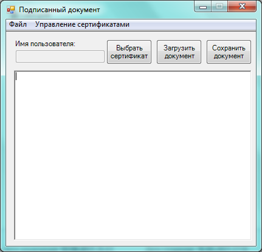

# Прототип системы электронного документооборота с использованием сертификатов
***
## Постановка задачи
* Приложение должно обеспечивать обмен между пользователями подписанными текстовыми документами.
* Приложение должно позволять редактировать текстовые документы, а также сохранять и загружать их вместе с электронной
  подписью.
* Для вычисления и проверки подписи используются закрытые ключи и сертификаты участников обмена сообщениями.

## Пользовательский интерфейс
1. Нередактируемая строка под надписью «Имя пользователя» предназначена для отображения имени владельца сертификата, 
   используемого для вычисления и проверки электронной подписи (пока имя пользователя не задано, создание или 
   редактирование подписанных документов невозможны). Поле с текстовым редактором под не редактируемой строкой 
   предназначено для ввода и редактирования текстов подписанных документов. Кнопка «Выбрать сертификат» на главной форме
   используется для переключения на новый сертификат (нового пользователя). Эта кнопка дублирует команду «Выбрать» меню 
   «Управление сертификатами». Кнопки «Загрузить документ» и «Сохранить документ» дублируют команды «Загрузить» и 
   «Сохранить» меню «Файл».
   
   
2. Команда «Создать» меню «Файл» предназначена для создания нового документа (очищается содержимое поля с текстовым редактором, а в заголовок формы помещается текст «Подписанный документ»).

### Пример главной формы и интерфейса приложения

Пример главной формы приложения

Пример состава меню "Файл" приложения

Пример состава меню "Управление сертификатами" приложения

3. Команда «Сохранить» меню «Файл» предназначена для сохранения созданного (отредактированного) документа в виде массива
   байт вместе с вычисляемой электронной подписью и сертификатом автора документа в папке и файле (рекомендуется с 
   расширением sd), выбираемыми пользователем. Структура подписанного документа приведена в <u>**Таблице 1**</u>. 
   Алгоритмы электронной подписи и хеширования массива байт документа выбираются из <u>**Таблицы 2**</u>. Если 
   пользователь пытается подписать и сохранить документ, не выбрав предварительно сертификат, выводится соответствующее 
   сообщение.
   
   
4. Команда «Загрузить» меню «Файл» предназначена для чтения подписанного документа из папки и файла, выбираемых 
   пользователем, извлечения из документа массива байт с сертификатом его автора, построения цепочки сертификации для 
   извлеченного сертификата и ее проверки, извлечения из сертификата имени его владельца (субъекта), извлечения и 
   проверки подписи автора под документом и отображением текста проверенного документа в поле с текстовым редактором на 
   главной форме. Имя автора проверенного документа должно отображаться в заголовке главной формы после слов 
   «Подписанный документ». Если документ с заданным именем не найден, проверка не подтвердила подлинность сертификата 
   автора документа, не подтверждается подпись под документом, приложение должно выводить соответствующие сообщения.
   

5. Команда «Выход» меню «Файл» предназначена для завершения работы приложения. Команда «О программе» меню «Файл» 
   предназначена для вывода формы с информацией об авторе приложения (фамилии и инициалах студента, номере учебной 
   группы и номере варианта).
   

6. Команда «Удалить» меню «Управление сертификатами» предназначена для удаления сертификата и закрытого ключа 
   пользователя из его хранилища личных сертификатов.
   

7. Команда «Выбрать» меню «Управление сертификатами» предназначена для отображения стандартного диалога выбора 
   сертификата в хранилище личных сертификатов и, при выборе пользователем его сертификата, отображения имени субъекта в
   не редактируемой строке для имени пользователя.
   

8. После завершения разработки приложения провести его тестирование. Рекомендуемый порядок действий при тестировании:
*	Импортировать (при необходимости) сертификаты, созданные при выполнении лабораторной работы 2, из файлов формата PFX с помощью соответствующей команды контекстного меню Проводника Windows;
*	Создать небольшой текстовый документ и сохранить его;
*	Передать файл с подписанным документом другим пользователям;
*	Получить и импортировать сертификаты других пользователей;
*	Получить и прочитать документы других пользователей;
*	Удалить свой сертификат.

**<u>Таблица 1</u>**\
Структура подписанного документа

| Длинна сертификата | Длина подписи | Сертификат пользователя | Электронная подпись | Текст документа |
| :----------------: |:-------------:| :----------------------:| :-----------------: | :--------------:|

**<u>Таблица 2</u>**\
Вариант индивидуального задания

| Алгоритм хеширования документа | Алгоритм подписи документа |
| :-----------------------------:| :------------------------: |
|              MD5               |            RSA             |

